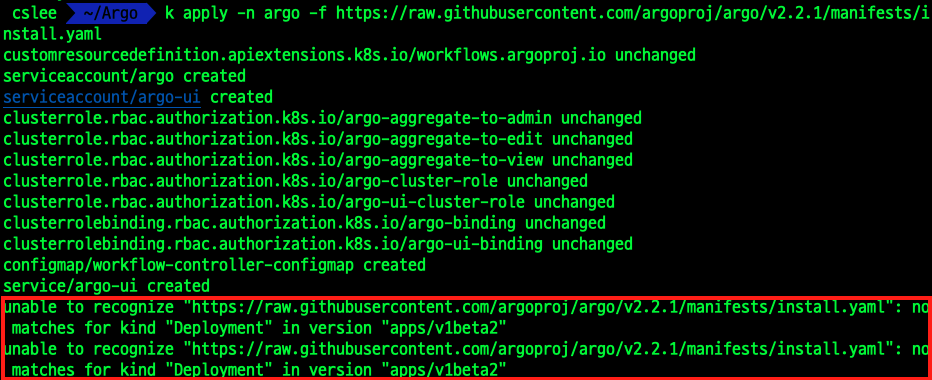

## Minikube
- Minikube 를 설치하면 마스터 노드를 하나 생성하여 k8s 실습을 진행할 수 있습니다.

## Argo
- Argo 는 Argo Workflow 이름 그대로 워크플로우 역할을 합니다.
- 도커 이미지로 된 컨테이너들을 가지고 yaml 로 명세한 순서, 방법(직렬, 병렬, DAG . . .)으로 일을 수행합니다.

## 설치 가이드 진행 중 오류발생 해결
- Load the default configuration from the Argo github repository
```kubectl apply -n argo -f https://raw.githubusercontent.com/argoproj/argo/v2.2.1/manifests/install.yaml```
### 에러

### 해결
1. 해당 링크로 직접 이동해서 내용을 전체 복사한다.
2. vi install.yaml 파일 생성 후 복사한 내용 붙여넣기
3. kind: Deployment 인 것들이 2개 있는데 그 2개의 apiVersion 을 apps/v1 으로 변경해줍니다.

### Reference
- [https://kubernetes.io/ko/docs/tasks/tools/install-minikube/]: Minikube 설치 가이드
- [https://medium.com/@doronsegal/workflow-using-argo-kubernetes-6b45ef3f1614]: Argo 설치 가이드(eng) 