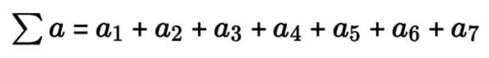
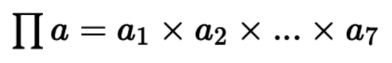

# for 반복문과 리스트, 항등원, 총합과 총곱

1. 항등원

임의의 원소에 특정 연산을 했을 때 재귀시키는 원소

```python
A + ? = A
A * ? = A
?: 항등원

10 + ? = 10 # 숫자 덧셈의 항등원: 0
10 * ? = 10 # 숫자 곱셈의 항등원: 1
```

2. 총합과 총곱 

```python
a = (10, 20, 30) # 수열: 숫자의 나열

# 총합: 모두 더 한다.
# sum 이라고 부르는 시그마 기호(Σ) 이다. 즉, 모든 요소를 더해주면 된다.

sum(a)

# 총곱: 모두 곱 한다.
# math.prod() 함수로 곱하기를 구현한다.

import math

math.prod(a)

```

### 시그마(∑)


### 파이(π)


1. for 반복문의 기본 구조 

```python
for 반복변수 in 리스트:
    복합구문

a = [1,2,3,4,5]
for aa in a:
    print(aa)
```

2. for 반복문으로 총합과 총곱 구하기

